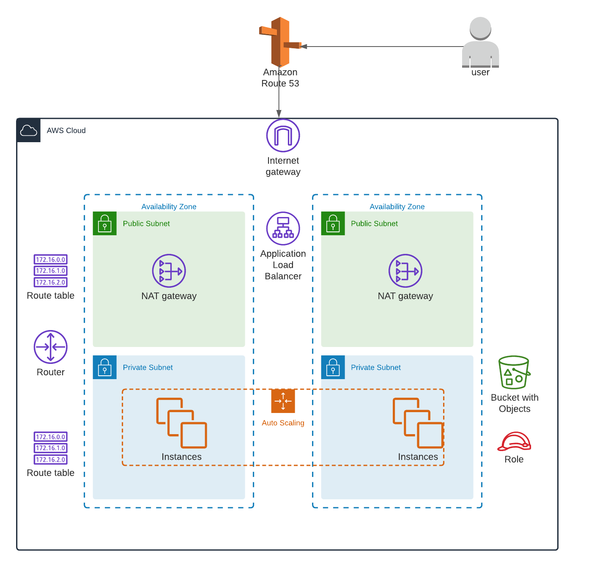

# AWS Load Balanced Website

This project aims to deploy a sample website in a load-balanced, highly available, and resilient manner utilizing automation and AWS best practices.

**Built with**

Terraform manages the deployment.

**Getting started**

Clone the repository locally in your system:

`git clone https://github.com/cloudacia/terraform-lab02`

Deploy the code in your AWS account with Terraform

`cd terraform-lab02`


`terraform init`


`terraform apply`


**Folder structure options and naming conventions for software projects**
```
.
|-- main.tf               # AWS provider's configuration
|-- networking.tf         # VPC, subnet, routing tables, etc.
|-- autoscaling.tf        # AutoScaling and Launch configuration
|-- loadbalancer.tf       # Load balancer and target group
|-- security.tf           # Security groups
|-- ssh_keys.tf           # EC2 key
|-- variables.tf          # Variables
|-- iam.tf                # roles and policies
|-- storage.tf            # S3 buckets
|-- dns.tf                # DNS setting for a domain name
|-- output.tf             # Output values
|-- script.sh             # Initialization script
|-- /ssh_keys             # SSH public key
|-- /app                  # Simple web app
|-- diagram.png           # AWS network layout
|-- LICENSE.txt
|-- README.md
```

**Architecture**



**Contributing**

Contributions are what make the open-source community such an amazing place to learn, inspire, and create. Any contributions you make are greatly appreciated.

If you have a suggestion to improve this, please fork the repo and create a pull request. You can also open an issue with the tag "enhancement".

Don't forget to give the project a star! Thanks again!

**License**

It is distributed under the MIT License. See LICENSE.txt for more information.

**Contact**

Name: Eugenio Duarte

Email: eduarte@cloudacia.com
